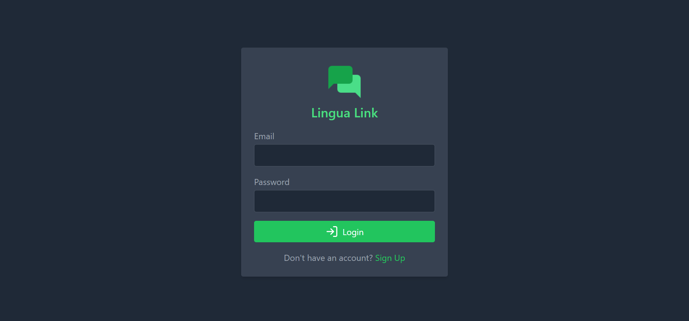

# Lingua Link Chat App

Lingua Link is a real-time chat application that allows users to create and join chat rooms, send messages, and manage their profiles. It is built using React, Firebase, and other modern web technologies.




## Table of Contents

- [Architecture Overview](#architecture-overview)
- [Technologies Used](#technologies-used)
- [Setup Instructions](#setup-instructions)
  - [Prerequisites](#prerequisites)
  - [Installation](#installation)
  - [Configuration](#configuration)
  - [Running the Application](#running-the-application)
- [Project Structure](#project-structure)
- [Acknowledgements](#acknowledgements)

## Architecture Overview

Lingua Link follows a client-server architecture, where the client-side is built using React and the server-side is managed by Firebase services. Here's an overview of the architecture:

- **Client-side**:

  - Built using React, a popular JavaScript library for building user interfaces.
  - Utilizes React Router for client-side routing.
  - Uses Firebase Authentication for user authentication.
  - Manages state using React's built-in useState and useEffect hooks, along with Firebase Firestore for real-time data synchronization.
  - Utilizes Firebase Storage for storing profile images.
  - Employs Lucide icons for the user interface's iconography.
  - Uses React Toastify for displaying notifications to users.

- **Server-side**:
  - Managed by Firebase services, including Firestore for real-time database functionality and Authentication for user authentication.
  - Uses Firebase Storage for storing profile images.

## Technologies Used

- **Frontend**:

  - React
  - React Router DOM
  - Lucide React (for icons)
  - React Toastify
  - Tailwind CSS (for styling)

- **Backend**:

  - Firebase Firestore (NoSQL database)
  - Firebase Authentication
  - Firebase Storage

- **Development Tools**:
  - Vite (build tool)
  - ESLint (for code linting)
  - PostCSS (for CSS processing)
  - Tailwind CSS (utility-first CSS framework)

## Setup Instructions

### Prerequisites

Before getting started, ensure you have the following installed on your machine:

- Node.js (version 14 or above)
- npm or yarn package manager
- Firebase account and project setup

### Installation

1. Clone the repository to your local machine:

   ```bash
   git clone https://github.com/Talha-Bruh/Lingua-Link.git
   ```

2. Navigate to the project directory:

   ```bash
   cd lingua-link
   ```

3. Install project dependencies:

   ```bash
   npm install
   ```

   or

   ```bash
   yarn install
   ```

### Configuration

1. Create a Firebase project and set up Firebase Authentication, Firestore, and Storage services.
2. Obtain your Firebase configuration settings.
3. Create a `.env` file in the root directory of the project.
4. Add your Firebase configuration settings to the `.env` file:

   ```plaintext
   REACT_APP_FIREBASE_API_KEY=your-api-key
   REACT_APP_FIREBASE_AUTH_DOMAIN=your-auth-domain
   REACT_APP_FIREBASE_PROJECT_ID=your-project-id
   REACT_APP_FIREBASE_STORAGE_BUCKET=your-storage-bucket
   REACT_APP_FIREBASE_MESSAGING_SENDER_ID=your-messaging-sender-id
   REACT_APP_FIREBASE_APP_ID=your-app-id
   ```

### Running the Application

Once you've completed the setup and configuration, you can run the application locally:

```bash
npm run dev
```

or

```bash
yarn dev
```

This command starts the development server, and you can access the application at `http://localhost:5173`.

## Project Structure

The project structure follows a typical React application structure, with the main components being:

- **src/**
  - **components/**: Contains React components used throughout the application.
  - **context/**: Contains React context providers for managing application state.
  - **firebase/**: Firebase configuration and initialization files.
  - **styles/**: Contains global styles and Tailwind CSS configuration.

## Author

- Portfolio: [Talha Hussain](https://my-portfolio-oohleq9z1-talhabruhs-projects.vercel.app/)
- Linkedin: [SyedTalhaShah](https://www.linkedin.com/in/syed-talha-shah-60726a221/)
- Email: [talhahussain349@gmail.com](mailto:talhahussain349@gmail.com)

## License

MIT License

Copyright (c) 2022 Talha Bruh

Permission is hereby granted, free of charge, to any person obtaining a copy
of this software and associated documentation files (the "Software"), to deal
in the Software without restriction, including without limitation the rights
to use, copy, modify, merge, publish, distribute, sublicense, and/or sell
copies of the Software, and to permit persons to whom the Software is
furnished to do so, subject to the following conditions:

The above copyright notice and this permission notice shall be included in all
copies or substantial portions of the Software.

THE SOFTWARE IS PROVIDED "AS IS", WITHOUT WARRANTY OF ANY KIND, EXPRESS OR
IMPLIED, INCLUDING BUT NOT LIMITED TO THE WARRANTIES OF MERCHANTABILITY,
FITNESS FOR A PARTICULAR PURPOSE AND NONINFRINGEMENT. IN NO EVENT SHALL THE
AUTHORS OR COPYRIGHT HOLDERS BE LIABLE FOR ANY CLAIM, DAMAGES OR OTHER
LIABILITY, WHETHER IN AN ACTION OF CONTRACT, TORT OR OTHERWISE, ARISING FROM,
OUT OF OR IN CONNECTION WITH THE SOFTWARE OR THE USE OR OTHER DEALINGS IN THE
SOFTWARE.
